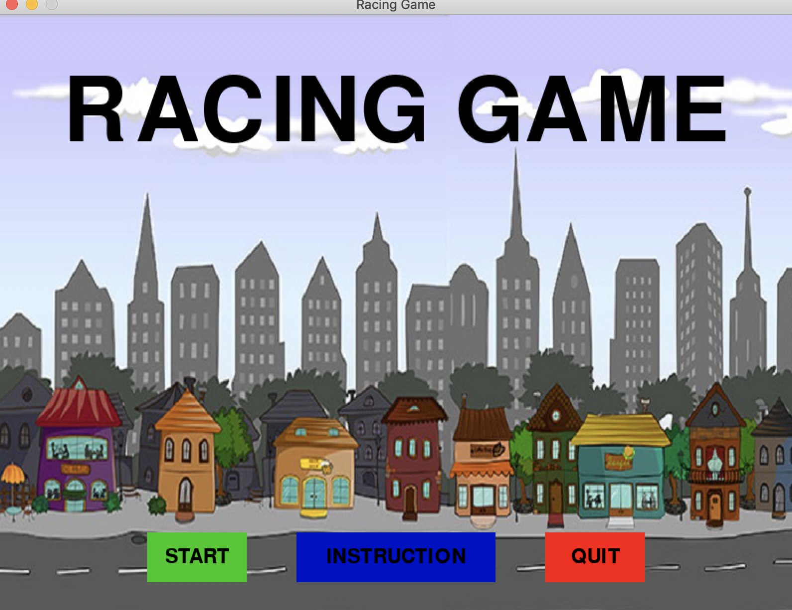
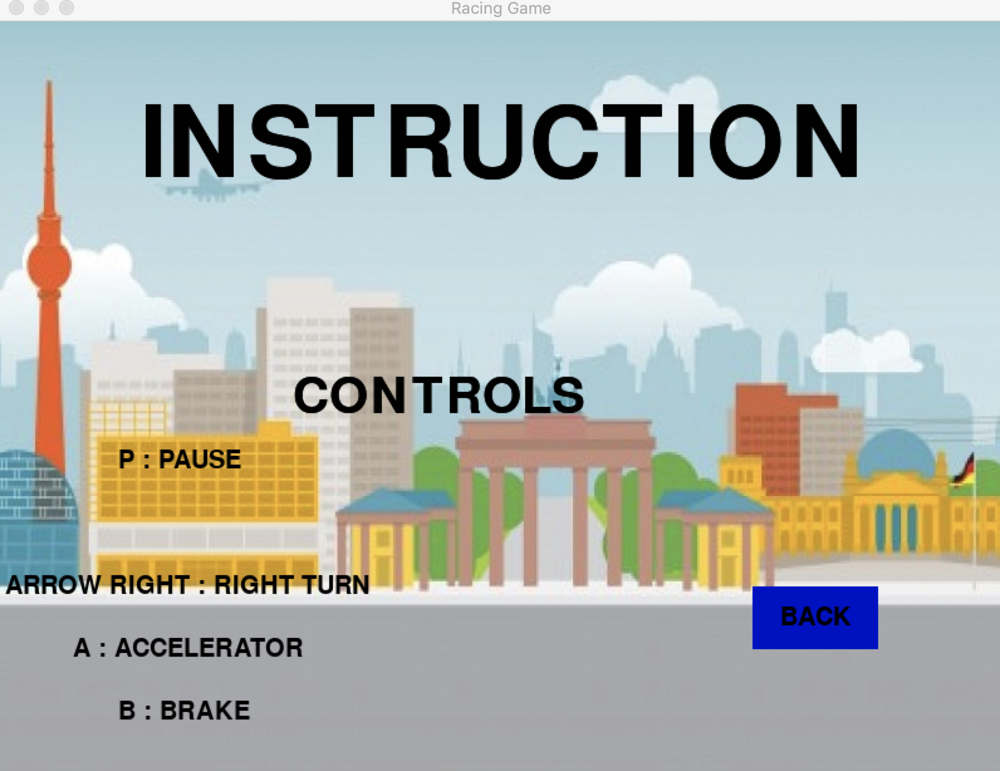
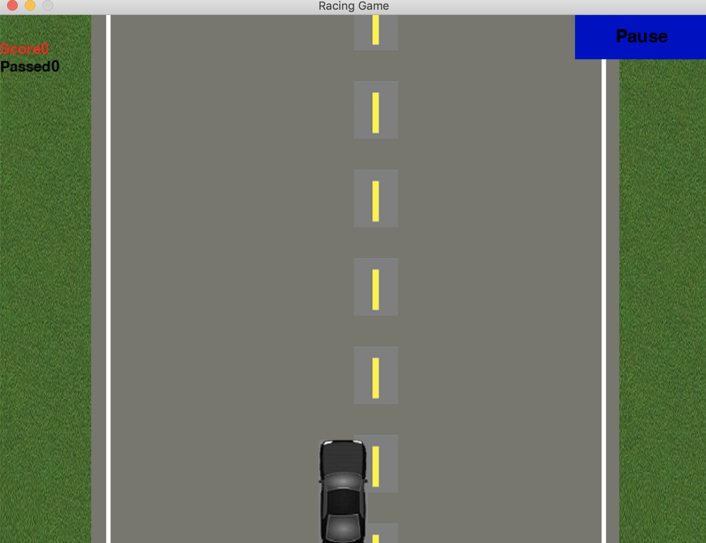

# Racing game
A simple car racing game written in python.

# Run a program
Run script from the root directory of the project:
```bash
python racing.py
```

# Demo
**Introduction menu**


**Instruction menu**


**Game runner menu**


# Contributing

- clone the repository
- configure Git for the first time after cloning with your name and email
  ```bash
  git config --local user.name "Volodymyr Yahello"
  git config --local user.email "vyahello@gmail.com"
  ```
- `python3.6` is required to run the code
- run `pip install -r requirements.txt` to start using a program
